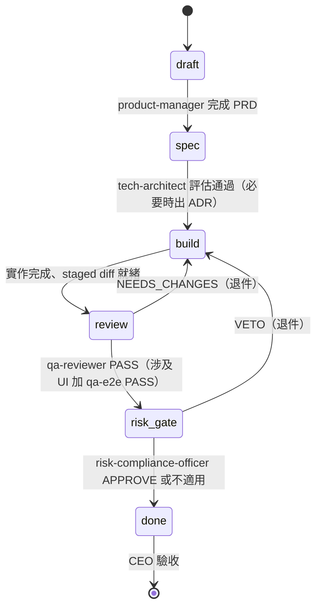

# 交接協定（handoff protocol）

> 定義部門之間怎麼交接任務：任務單格式、狀態機、退件規則、否決權。
> 所有跨部門交接一律附任務單；口頭（對話）交接不算數。

## 任務單格式

每個任務開一張任務單（由 product-manager 建立，放 `work/tasks/<任務代號>.md`）：

```markdown
# 任務單：<任務代號> <標題>

- 狀態：draft | spec | build | review | risk-gate | done
- 發起人：CEO
- 目前負責：<agent-name>
- 相關文件：<PRD / ADR / art brief 連結>

## 目標
（一段話）

## 驗收條件
（Given/When/Then，逐條）

## 交接紀錄
- <日期> <from> → <to>：<一句話交接內容或退件理由>
```

## 狀態機



| 狀態 | 意義 | 誰能推進 |
| --- | --- | --- |
| `draft` | 想法進來，還沒規格化 | product-manager |
| `spec` | PRD 與驗收條件已定 | tech-architect（評估通過才放行）|
| `build` | 實作中 | 實作部門 |
| `review` | 審查中（qa-reviewer 必經；UI 加 qa-e2e） | qa-reviewer / qa-e2e |
| `risk-gate` | 風險閘門（僅面向使用者的建議類產出必經；其他任務可直接視為通過） | risk-compliance-officer |
| `done` | 完成，待 CEO 驗收 | CEO |

## 退件規則

1. **退件必附理由**：逐條列出問題（分類 + severity + 建議），寫進任務單交接紀錄。
2. **退回給原負責人**，不得跳過原負責人直接找別人重做。
3. **輸入不齊也算退件**：接手者發現輸入契約缺件，退回上一手並指名向誰要什麼。
4. **兩輪不收斂就升級**：同一張任務單在同一關卡退件兩次仍未通過，升級 CEO 裁決，不得無限循環。
5. 退件不可跳關：修完從 `build` 重新走 `review`，不得直接跳 `done`。

## 否決權

| 擁有者 | 範圍 | 效果 |
| --- | --- | --- |
| `tech-architect` | 架構決策、模組邊界、新依賴 | 被否決的方案不得進入 `build` |
| `risk-compliance-officer` | 面向使用者的建議類文案、風險上限設定、免責聲明 | 被否決的產出不得進入 `done` |
| CEO | 一切 | 最終裁決；否決權衝突時由 CEO 拍板並留書面紀錄 |

## 升級規則（何時直接找 CEO）

- 需求彼此衝突或優先序不明。
- 同一關卡退件兩輪未收斂。
- 需要花錢（付費 API、付費部署方案）。
- 發現祕密外洩或重大安全事件（立即升級）。
- 規則／模型結論衝突且無法並陳解決。
