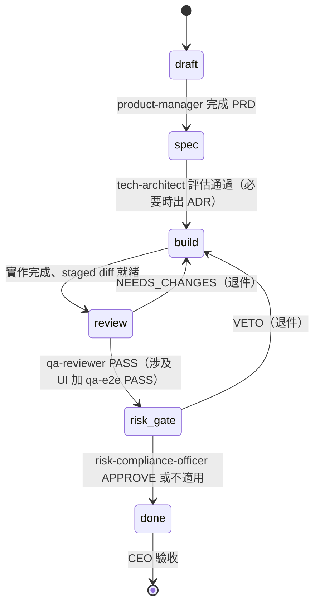

# 交接協定（handoff protocol）

> 定義部門之間怎麼交接任務：任務單格式、狀態機、退件規則、否決權。
> 所有跨部門交接一律附任務單；口頭（對話）交接不算數。

## 任務單格式

每個任務開一張任務單（由 product-manager 建立，放 `work/tasks/<任務代號>.md`）：

```markdown
# 任務單：<任務代號> <標題>

- 狀態：draft | spec | build | review | risk-gate | done
- 發起人：CEO
- 目前負責：<agent-name>
- 相關文件：<PRD / ADR / art brief 連結>

## 目標
（一段話）

## 驗收條件
（Given/When/Then，逐條）

## 交接紀錄
- <日期> <from> → <to>：<一句話交接內容或退件理由>
```

## 狀態機


```mermaid
stateDiagram-v2
    [*] --> draft
    draft --> spec : product-manager 完成 PRD
    spec --> build : tech-architect 評估通過（必要時出 ADR）
    build --> review : 實作完成、staged diff 就緒
    review --> build : NEEDS_CHANGES（退件）
    review --> risk_gate : qa-reviewer PASS（涉及 UI 加 qa-e2e PASS）
    risk_gate --> build : VETO（退件）
    risk_gate --> done : risk-compliance-officer APPROVE 或不適用
    done --> [*] : CEO 驗收
```

| 狀態 | 意義 | 誰能推進 |
| --- | --- | --- |
| `draft` | 想法進來，還沒規格化 | product-manager |
| `spec` | PRD 與驗收條件已定 | tech-architect（評估通過才放行）|
| `build` | 實作中 | 實作部門 |
| `review` | 審查中（qa-reviewer 必經；UI 加 qa-e2e） | qa-reviewer / qa-e2e |
| `risk-gate` | 風險閘門（僅面向使用者的建議類產出必經；其他任務可直接視為通過） | risk-compliance-officer |
| `done` | 完成，待 CEO 驗收 | CEO |

## 退件規則

1. **退件必附理由**：逐條列出問題（分類 + severity + 建議），寫進任務單交接紀錄。
2. **退回給原負責人**，不得跳過原負責人直接找別人重做。
3. **輸入不齊也算退件**：接手者發現輸入契約缺件，退回上一手並指名向誰要什麼。
4. **兩輪不收斂就升級**：同一張任務單在同一關卡退件兩次仍未通過，升級 CEO 裁決，不得無限循環。
5. 退件不可跳關：修完從 `build` 重新走 `review`，不得直接跳 `done`。

## 否決權

| 擁有者 | 範圍 | 效果 |
| --- | --- | --- |
| `tech-architect` | 架構決策、模組邊界、新依賴 | 被否決的方案不得進入 `build` |
| `risk-compliance-officer` | 面向使用者的建議類文案、風險上限設定、免責聲明 | 被否決的產出不得進入 `done` |
| CEO | 一切 | 最終裁決；否決權衝突時由 CEO 拍板並留書面紀錄 |

## 派工佇列(dispatch queue)

> 目的:任務狀態不能只活在對話裡。環境回滾或 agent 無聲死亡後,
> 協調者必須能從 repo 檔案恢復現場,而不是靠記憶。

1. **先落地再派工**:協調者每派出一個背景 agent,必先在 `work/dispatch/<日期>-<代號>.md`
   建立派工單並 commit,然後才呼叫 agent。
2. **派工單必填欄位**:狀態(`pending | running | done | failed`)、承辦 agent、分支、
   預算上限、範圍清單、**恢復指引**(回滾後如何判斷做到哪、怎麼補派)。
3. **完成即回填**:agent 交件後,協調者更新狀態為 `done`(或 `failed` 附原因)並記錄產出 commit。
4. **回滾恢復程序**:環境回滾後,協調者第一件事是掃 `work/dispatch/` 中所有非 `done` 的派工單,
   依恢復指引逐一盤點、補派。

## 派工預算與存檔點

1. **每次派工的 prompt 必載明**:範圍清單(做哪幾件、不做什麼)與輸出 token 上限(數量級即可)。
2. **存檔點紀律**:背景 agent 每完成一個檔案/語意單位立即 commit;
   協調者在長任務中定期 push 存檔點到遠端,防容器回滾遺失狀態。
3. 預算內做不完屬正常情況:agent 應在預算用盡前 commit 現有進度並回報「做到哪、剩什麼」,
   由協調者決定補派,不得為趕完而略過驗證。

## 審查紀錄與機械閘門

1. **審查必留紀錄檔**:qa-reviewer 審查通過後,協調者將審查結果落檔
   `work/reviews/<任務代號>-review.md`。結論行必須**獨立成行**,格式 `結論:PASS`
   (退件則為 `結論:NEEDS_CHANGES`);同一檔案多輪覆核時,**以最後一個結論行為準**。
   紀錄檔範本:

   ```markdown
   # 審查紀錄:<任務代號> <標題>

   - 審查者:qa-reviewer
   - 日期:<日期>
   - 審查範圍:<diff 範圍與對應 commit SHA / PR 編號>
   - Codex 第二意見:<可用/不可用(降級為強化人工複查)>

   ## 發現事項
   (BLOCKING_ISSUES 與非阻擋建議,逐條)

   結論:PASS
   ```

2. **CI 強制**:每個 PR 必須新增或更新至少一份最終結論為 `結論:PASS` 的審查紀錄檔;
   `scripts/check_review_record.py`(CI 的 `review-record` job)找不到就把該 PR 擋下、無法合併。
   注意:這是**輕量文字檢查、非防偽驗證**——它擋得住「忘記審查」,擋不住「偽造紀錄」,
   後者仍靠流程紀律與 CEO 抽查;紀錄檔中的 commit SHA 欄位供事後追溯。
3. **遠端 branch protection(CEO 一次性設定)**:GitHub → Settings → Branches 對 `main` 與 `product/*`
   啟用:Require a pull request before merging、Require status checks(`validate-agents`、`review-record`)、
   禁止 force push。

## 升級規則（何時直接找 CEO）

- 需求彼此衝突或優先序不明。
- 同一關卡退件兩輪未收斂。
- 需要花錢（付費 API、付費部署方案）。
- 發現祕密外洩或重大安全事件（立即升級）。
- 規則／模型結論衝突且無法並陳解決。
