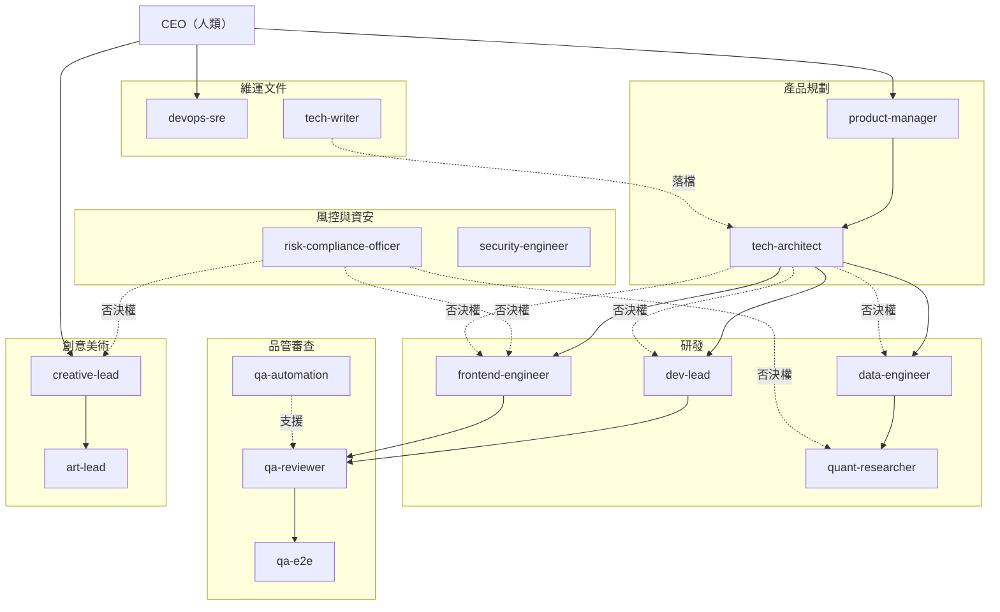

# 組織圖（org chart）

> 本檔是公司組織的唯一真相來源（single source of truth）。
> `scripts/validate_agents.py` 會檢查「部門總表」與 `.claude/agents/` 的實際檔案 100% 一致——
> 新增或移除 agent 時，必須同步更新本表。

## 組織圖



## 部門總表

| Agent | 部門 | 一行職責 | 權限型態 |
| --- | --- | --- | --- |
| `product-manager` | 產品 | 需求澄清 → PRD → 驗收條件（Given/When/Then），所有任務的入口 | 可寫文件 |
| `tech-architect` | 架構 | 技術選型、模組邊界、ADR 決策草案；對架構決策有否決權 | 唯讀 |
| `dev-lead` | 研發 | 後端／核心邏輯實作、修 bug、重構、跑測試 | 實作 |
| `frontend-engineer` | 研發 | 前端 UI 實作、可存取性、前端效能預算 | 實作 |
| `data-engineer` | 資料 | 資料源接入、schema、ETL／排程、資料品質與新鮮度 | 實作 |
| `quant-researcher` | 量化研究 | 特徵工程、統計／ML 模型、回測方法論、防 look-ahead bias | 實作 |
| `qa-reviewer` | 品管審查 | code review（含 Codex 跨廠商第二意見），下 PASS／NEEDS_CHANGES | 唯讀 |
| `qa-automation` | 品管審查 | 單元／整合／E2E 自動化測試、覆蓋率門檻、golden test | 實作（限測試） |
| `qa-e2e` | 品管審查 | 實機驗收：跑 app、點流程、截圖回報 | 唯讀 + preview |
| `risk-compliance-officer` | 風控法遵 | 風險上限、免責聲明、建議類文案最終把關；有否決權 | 唯讀 |
| `security-engineer` | 資安 | secrets 管理、依賴弱點掃描、輸入驗證、OWASP 檢查 | 實作 |
| `devops-sre` | 維運 | CI/CD、環境、部署、監控、log 與告警、版本查證 | 實作 |
| `creative-lead` | 創意 | 發想、企劃、命名、文案、內容策略 | 可寫文件 |
| `art-lead` | 美術 | 美術方向、視覺規範、art brief、風格一致性 | 可寫文件 |
| `tech-writer` | 文件 | README、API 文件、ADR 落檔、changelog、交接文件 | 可寫文件 |

## 上下游關係（標準流向）

```
CEO → product-manager（PRD）→ tech-architect（技術評估 / ADR）
    → 實作部門（dev-lead / frontend-engineer / data-engineer / quant-researcher）
    → qa-reviewer（+ Codex 第二意見）→ [涉及 UI] qa-e2e 實機驗收
    → [面向使用者的建議類產出] risk-compliance-officer 風險閘門
    → CEO 驗收
```

- 詳細任務單格式、狀態機與退件規則見 [`docs/handoff-protocol.md`](handoff-protocol.md)。
- **否決權**：`tech-architect`（架構決策）、`risk-compliance-officer`（建議類文案與風險設定）。被否決的產出不得進入下一狀態。

## 本次擴編決策紀錄（2026-07）

- `devops` → 併入 **`devops-sre`**：原 devops（待命職位）職責是新 devops-sre 的真子集（建置／部署／CI），保留兩者會造成派工混淆，故合併並擴充監控、log、告警與版本查證職責。
- **不新增 `code-reviewer`**：`qa-reviewer` 已是獨立於研發線的唯讀審查者，並有跨廠商 Codex 第二意見，再設一位純重疊。
- **暫不設立**（需求出現時再議）：
  - `data-analyst`（產品指標分析）：目前無上線產品與流量數據，設了無事可做。
  - `finops`（用量與成本控管）：目前成本結構單純；若外部 API／模型用量成長，優先併入 devops-sre 或獨立設崗，屆時再評估。
  - `chief-of-staff`（跨部門協調）：小規模下由 CEO + handoff-protocol 狀態機覆蓋；若單一任務常態跨 4 個以上部門再設。

## TODO（待 CEO 決定）

- [ ] main 上仍有歷史產品碼（`apps/web/`、`work/` 的產品文件、`assets/`）。依「main = 員工線」哲學，建議擇期把它們遷到獨立產品分支後自 main 移除。兩個選項：(1) 遷移後 main 只留員工線，最乾淨但需要一次搬遷；(2) 維持現狀、僅凍結不再新增，成本低但 main 不純。本次擴編任務僅做員工線，未動這些檔案。
